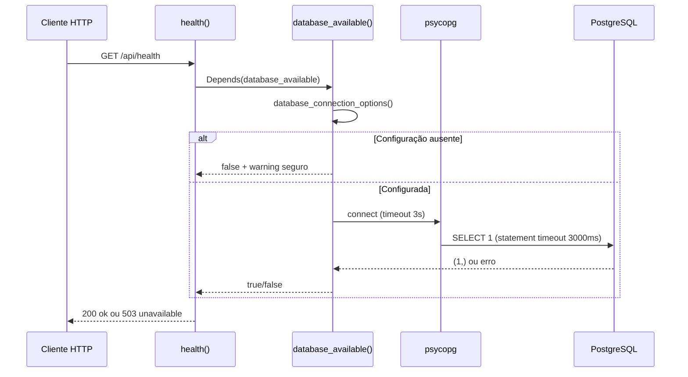
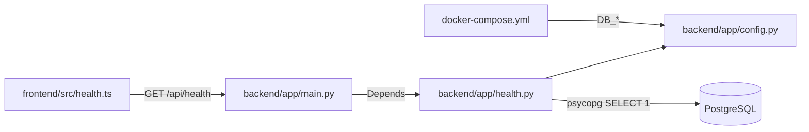

# Módulo backend

## Visão geral

O backend verifica a conexão com o PostgreSQL e devolve o estado de saúde para a interface. Hoje, ele não gerencia preços, contas ou qualquer outro dado de negócio. A evolução para monitoramento via `AmazonProvider`, persistência e autenticação está descrita no [contexto do produto](../product-context.md).

## Responsabilidades e arquivos

| Arquivo | Papel |
|---|---|
| [`backend/app/main.py#L1-L20`](../../backend/app/main.py) | Cria `FastAPI`, declara o modelo `HealthResponse` e a rota `health` |
| [`backend/app/config.py#L1-L17`](../../backend/app/config.py) | Lê `DATABASE_URL` ou os campos individuais de conexão |
| [`backend/app/health.py#L1-L31`](../../backend/app/health.py) | Executa consulta real `SELECT 1`, controla timeout e registra falha sem mensagem sensível |
| `backend/app/__init__.py` | Marca o pacote Python; não declara comportamento adicional |
| `backend/pyproject.toml` | Dependências, extras de desenvolvimento, pytest e Ruff |
| `backend/uv.lock` | Lock de dependências do backend |
| `backend/Dockerfile` | Constrói imagem Python e inicia Uvicorn |
| [`backend/tests/test_health.py`](../../backend/tests/test_health.py) | Testes HTTP com dependência substituída e teste de passagem segura de senha |
| [`backend/tests/test_health_integration.py`](../../backend/tests/test_health_integration.py) | Testes opcionais contra PostgreSQL real via `TEST_DATABASE_URL` |

## Modelo e dados

Não há modelos ORM, entidades ou esquema de domínio. `HealthResponse` é um modelo Pydantic de resposta, não uma tabela. Os campos são `status` e `database`, ambos limitados aos literais `ok` e `unavailable`. Veja [database.md](../database.md) para o estado completo do banco.

## Rotas

| Método e rota | Handler | Nome OpenAPI | Resposta |
|---|---|---|---|
| `GET /api/health` | `app.main.health` | `health` | 200 com dois campos `ok`; 503 com dois campos `unavailable` |
| `GET/HEAD /openapi.json` | Gerada por FastAPI | Fora do esquema | Publica o esquema OpenAPI |
| `GET/HEAD /docs` | Gerada por FastAPI | Fora do esquema | Interface Swagger UI |
| `GET/HEAD /docs/oauth2-redirect` | Gerada por FastAPI | Fora do esquema | Redirecionamento usado pela interface de documentação |
| `GET/HEAD /redoc` | Gerada por FastAPI | Fora do esquema | Interface ReDoc |

`/api/health` é a única rota declarada pela aplicação. Ela não recebe payload. Portanto não há validação de entrada 422 específica. A dependência `database_available` lê a configuração e conecta ao banco antes de montar a resposta. As demais rotas acima são criadas automaticamente pela configuração padrão de `FastAPI()`.

## Fluxo de verificação

Erros esperados do driver (`psycopg.Error`) e do sistema (`OSError`) são convertidos em indisponibilidade. O log registra o tipo da exceção, não seu texto, porque a mensagem do driver pode expor host, usuário ou senha.

## Integração com os módulos

O endpoint síncrono chama psycopg síncrono. Essa escolha combina com uma operação curta e não bloqueia uma rota `async`, pois a rota é definida com `def`. Uma futura operação de negócio precisa decidir entre endpoint síncrono para trabalho curto e driver assíncrono para trabalho não trivial.

## Configuração

`DATABASE_URL` tem precedência. Sem ela, são necessários `DB_HOST`, `DB_NAME`, `DB_USER` e `DB_PASSWORD`; `DB_PORT` é opcional e assume `5432` quando ausente. A configuração é rejeitada se algum valor resultante estiver vazio. Compose injeta os campos `DB_*` no container e usa host `db`.

## Testes

`test_health.py` verifica os dois status HTTP usando `app.dependency_overrides`, além de confirmar que uma senha contendo `@` é passada como parâmetro e não interpolada em conninfo. O teste de integração é ignorado se `TEST_DATABASE_URL` não estiver presente; com banco real, verifica sucesso e conexão para banco inexistente. Os comandos estão no [README](../../README.md).

## Pegadinhas e dívidas

- Health confirma conexão e `SELECT 1`, não schema ou saúde de dependências além do banco.
- Cada request abre e fecha uma conexão; não existe pool, retry ou cache.
- Falta de configuração e falha de banco compartilham a resposta 503.
- URL malformada configurada tem precedência e pode causar falha mesmo com `DB_*` válidas.
- Não há migrations, acesso a dados de domínio, autenticação, autorização ou rate limiting.
- O logger registra warning em toda falha; não há métrica ou alerta integrado.
