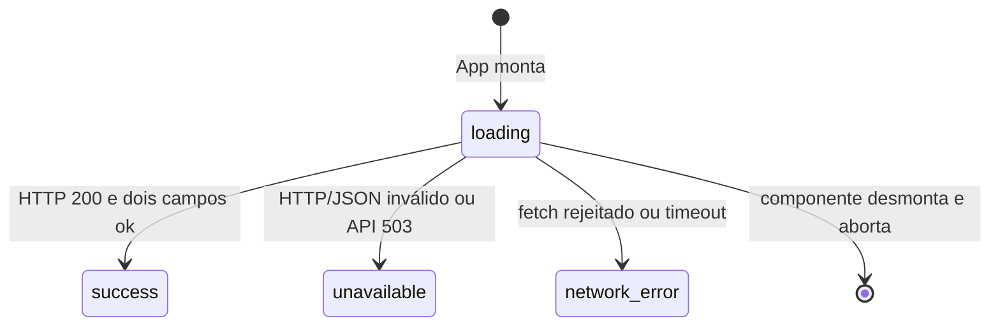
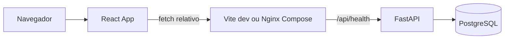

# Módulo frontend

## Visão geral

A interface é uma única página de status. Ela pergunta à API se a conexão com o banco funciona e mostra uma mensagem enquanto aguarda, quando dá certo e quando falha. Ela não envia comandos de negócio nem conversa diretamente com o banco.

## Responsabilidades e arquivos

| Arquivo | Papel |
|---|---|
| `frontend/src/main.tsx` | Monta React, `StrictMode`, `App` e estilos |
| [`frontend/src/App.tsx#L1-L65`](../../frontend/src/App.tsx) | Controla estado da página e apresenta acessivelmente os estados |
| [`frontend/src/health.ts#L1-L40`](../../frontend/src/health.ts) | Faz `fetch`, limita tempo, verifica HTTP e valida o JSON como `unknown` |
| `frontend/src/styles.css` | Estilo visual responsivo da página |
| `frontend/src/test-setup.ts` | Configuração compartilhada dos testes |
| [`frontend/src/App.test.tsx`](../../frontend/src/App.test.tsx) | Testes dos estados visíveis usando fetch simulado |
| `frontend/index.html` | Documento HTML inicial do Vite |
| `frontend/vite.config.ts` | Plugin React, Vitest/JSDOM e proxy local `/api` |
| `frontend/tsconfig.json` | Configuração TypeScript |
| `frontend/eslint.config.js` | Configuração ESLint |
| `frontend/package.json` / `frontend/package-lock.json` | Scripts e dependências travadas |
| `frontend/Dockerfile` | Build da SPA e imagem final Nginx |
| `frontend/nginx.conf` | Proxy de `/api/` e fallback SPA para `index.html` |

## Entidades e contrato HTTP

Não há entidades de domínio no frontend. `HealthResponse` em `health.ts` representa os dois formatos de JSON publicados pela API; `HealthResult` reduz isso aos estados de apresentação `success`, `unavailable` e `network-error`. Consulte [database.md](../database.md) para os dados persistidos (atualmente nenhum).

| Chamada | Handler | O que faz |
|---|---|---|
| `GET /api/health` | `checkHealth(signal?)` | Requisita o contrato de health; não há outros endpoints consumidos |

`checkHealth` só retorna sucesso para HTTP 200 e JSON com `status: "ok"` e `database: "ok"`. HTTP não-200, outro status, JSON inválido ou campos diferentes viram `unavailable`. Rejeição de `fetch` vira `network-error`.

## Fluxo de tela

`App` inicia em `loading`, dispara `checkHealth` em `useEffect` e aborta a requisição ao desmontar. A checagem estabelece timeout interno de 5 segundos. Na desmontagem, o resultado não atualiza estado. Mensagens de espera usam `role="status"` e falhas `role="alert"`.

## Integração

O caminho relativo `/api` permite que o proxy local do Vite e o Nginx do Compose resolvam o backend. O navegador não precisa de URL absoluta, CORS ou credencial de banco.

## Estados e limites

| Estado | Texto principal | Significado |
|---|---|---|
| `loading` | Verificando conexão… | A requisição está pendente |
| `success` | Tudo conectado | A API respondeu 200 com ambos os campos `ok` |
| `unavailable` | Serviço indisponível | API respondeu fora do contrato esperado |
| `network-error` | Não foi possível conectar à API | Falha de transporte, incluindo timeout |

## Pegadinhas e dívidas

- Não existe botão de tentar novamente; nova tentativa ocorre ao remontar/recarregar a página.
- O timeout interno é 5 segundos, mas o proxy Nginx tem timeout de conexão 2 segundos e envio/leitura 5 segundos; a camada que falhar primeiro determina a experiência.
- Uma resposta 200 com campos extras é aceita, desde que os dois campos necessários estejam corretos.
- Falha do endpoint e falha do banco são agregadas como indisponibilidade; a UI não distingue a causa.
- O indicador “Interface disponível” é estático e não é uma verificação independente do servidor web.
- A SPA é a única tela atual; não há rotas client-side, autenticação, formulários ou camada de estado global.
