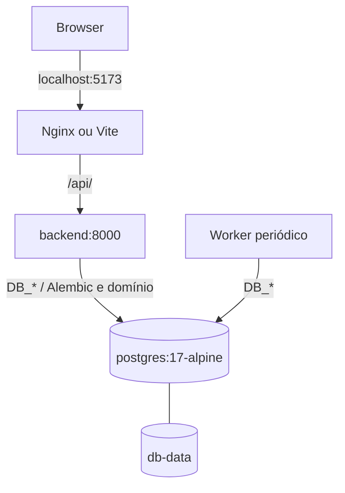
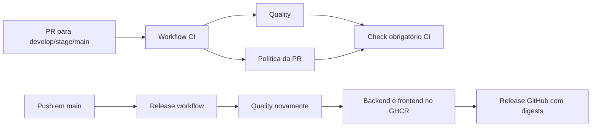

# Infraestrutura e automações

## Visão geral

Esta parte é a montagem do sistema: o Compose liga banco, API e interface no computador do desenvolvedor; os containers empacotam cada aplicação; e o GitHub Actions verifica as mudanças e publica imagens quando chegam à branch `main`. A publicação termina no registry e não instala a aplicação em um servidor de produção.

A direção de operação em LOCAL, DEV, STAGE e PROD, com configurações independentes e rollback, está no [contexto do produto](../product-context.md). DEV, STAGE e PROD ainda precisam de implantação configurada; branches de promoção não equivalem a ambientes provisionados.

## Arquivos e responsabilidades

| Arquivo | Papel |
|---|---|
| `docker-compose.yml` | Orquestra PostgreSQL, backend, worker, frontend, migration, portas e volume |
| `.env.example` | Exemplo local de variáveis do Compose |
| `backend/Dockerfile` | Imagem Python 3.13 slim com uv, Alembic e Uvicorn |
| `frontend/Dockerfile` | Build Node 22 e imagem final Nginx 1.27 |
| `frontend/nginx.conf` | Serve SPA e encaminha `/api/` ao backend |
| `scripts/compose-worktree.ps1` | Isola nome Compose, volume e portas por worktree no Windows |
| `.github/workflows/ci.yml` | Agrega qualidade e política de PR sob check obrigatório `CI` |
| `.github/workflows/quality.yml` | Ruff/pytest/PostgreSQL, lint/test/build React, Node tests e actionlint |
| `.github/workflows/project.yml` | Sincronização opcional com GitHub Project |
| `.github/workflows/release.yml` | Em `main`, publica imagens e cria release com digests |
| `.github/scripts/*.cjs` | Política de PR e integração GraphQL/Project, com testes Node adjacentes |

### Regras das automações GitHub

| Código | Responsabilidade observada |
|---|---|
| `policy.cjs` — `closingIssue`, `validatePullRequest`, `checkPullRequest` | Exige uma única linha de fechamento `Closes #n`, branch/base válidas, Issue aberta do repositório e referência à Issue nos commits (exceto commits de merge); limita validação a 250 commits |
| `project-state.cjs` — `projectStatus` | Mapeia Issue/PR para Backlog, In progress, In review, Develop, Stage ou Main |
| `sync-project.cjs` — função exportada e `wasClosedByDefaultBranchPr` | Busca estado atual do item, consulta eventos de fechamento da Issue, localiza campo/opção Status no Project e atualiza via GraphQL |
| `*.test.cjs` | Exercita regras de PR, mapeamento de status e sincronização com GraphQL simulado |

O sync mantém prioridade e ordenação existentes. Issue fechada só vai para Develop quando o evento de fechamento atual aponta para PR mergeada em `develop`; cancelamento como “não planejada” volta a Backlog porque não há opção `Canceled` no conjunto esperado. O Project precisa ter campo `Status` com opções existentes. A integração não cria campo nem opções automaticamente.

## Topologia local

O Compose publica serviços em loopback. As portas padrão são frontend 5173, backend 8000 e DB 5433; internamente, Nginx escuta 80 e PostgreSQL 5432. O healthcheck do banco bloqueia a inicialização do backend até o PostgreSQL responder `pg_isready`. O backend executa `alembic upgrade head` antes de Uvicorn. O worker inicia após o health check HTTP do backend e roda `python -m app.monitoring.worker`; sem a integração autorizada, aguarda sem consultar publicações.

## Variáveis do Compose e worktree

As variáveis da aplicação estão tabeladas em [architecture.md](../architecture.md#estado-desta-branch). `.env.example` inclui `MERCADOLIVRE_THIRD_PARTY_VALIDATED=false`, variáveis de cliente OAuth e chave Fernet vazias, `APP_ENV=development` e cinco parâmetros `MONITOR_*` de cadência, frescor, lote, concorrência e pausa. Compose repassa OAuth e `MONITOR_*` a backend e worker; não inicia autorização OAuth nem provisiona tokens. A renovação está implementada, mas ainda precisa de validação com a API oficial e a permissão para anúncios de terceiros continua sem prova. Os valores de monitoramento devem ser escolhidos conforme os limites oficiais validados; os padrões atuais permitem testar a operação local. O script de worktree também lê `BACKEND_PORT`, `FRONTEND_PORT` e `DB_PORT` do ambiente do PowerShell como overrides. Na ausência delas, deriva valores estáveis de branch e caminho, em faixas distintas; valida o intervalo `1..65535`; então restaura os valores de ambiente anteriores ao terminar.

O isolamento de projeto cria nomes e volumes distintos por worktree. As portas ainda podem conflitar com outro processo. O script não cria senhas próprias: Compose continua exigindo `POSTGRES_PASSWORD` em `.env` ou no ambiente.

## CI e entrega

Quality usa Python 3.13 e PostgreSQL 17 para testes do backend; Node 22 para lint, testes e build do frontend; testes `node --test .github/scripts/*.test.cjs`; e actionlint. O workflow `CI` é o check agregado exigido e falha se algum gate necessário falhar ou for cancelado.

Em `main`, `release.yml` cria ou valida uma tag `build-<sha12>` ou uma versão `vMAJOR.MINOR.PATCH`, executa Quality e publica as duas imagens no GHCR com tags da versão e SHA. Gera SBOM/proveniência e cria release contendo os digests das imagens. Imagens Linux são montadas para o ambiente padrão do workflow. Uma falha parcial pode deixar uma imagem publicada sem release completa.

## Integrações operacionais

`project.yml` reage a eventos de Issues e PRs e pode atualizar um GitHub Project. Sem `PROJECT_TOKEN`, emite aviso e encerra como não sincronizado; `PROJECT_OWNER` e `PROJECT_NUMBER` identificam o Project quando configurado. O token não é passado a código da cabeça da PR: o workflow faz checkout da branch padrão. Detalhes de permissões e reconciliação estão em [github-workflow.md](../github-workflow.md).

## Operação diária

- Subir stack: `docker compose up --build`.
- Parar mantendo dados: `docker compose down`.
- Banco isolado: `docker compose up -d db`.
- Worktree Windows: `./scripts/compose-worktree.ps1 up --build` e `./scripts/compose-worktree.ps1 down`.
- Consultar logs: `docker compose logs -f db backend worker frontend`.
- Publicação: ocorre no fluxo de promoção e merge em `main`; não é implantação em cloud.

## Pegadinhas e dívidas

- `depends_on` do frontend apenas ordena inicialização; o backend tem healthcheck HTTP em `/api/health` para iniciar o worker.
- `docker compose down` preserva `db-data`; `down -v` remove o volume e seus dados.
- O backend espera banco healthy e aplica as migrations antes de iniciar. A stack isolada `bestprice0013verify` foi reconstruída: revisão `20261009safe`, health da API e worker aguardando autorização foram conferidos. Pelo proxy Nginx, login retornou 200, URL inválida 400 e anúncio novo sem integração 503. Esses testes não cobriram OAuth real, consulta ao Mercado Livre nem navegação visual; veja [verification.md](../../specs/0013-monitoramento-mercado-livre-brasil/verification.md).
- O frontend de container é uma imagem Nginx; o modo de desenvolvimento usa Vite e proxy próprio.
- Não há ambiente de implantação, HTTPS público, destino, credencial/OIDC, migração de produção ou rollback automatizado.
- Sincronização do GitHub Project é condicional a segredo/variáveis ainda não configurados; não assuma que eventos já aparecem num board.
- Dockerfiles usam versões fixas ou major/minor específicas em imagens base; dependências externas e Actions fixadas precisam de manutenção periódica.
