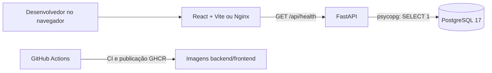
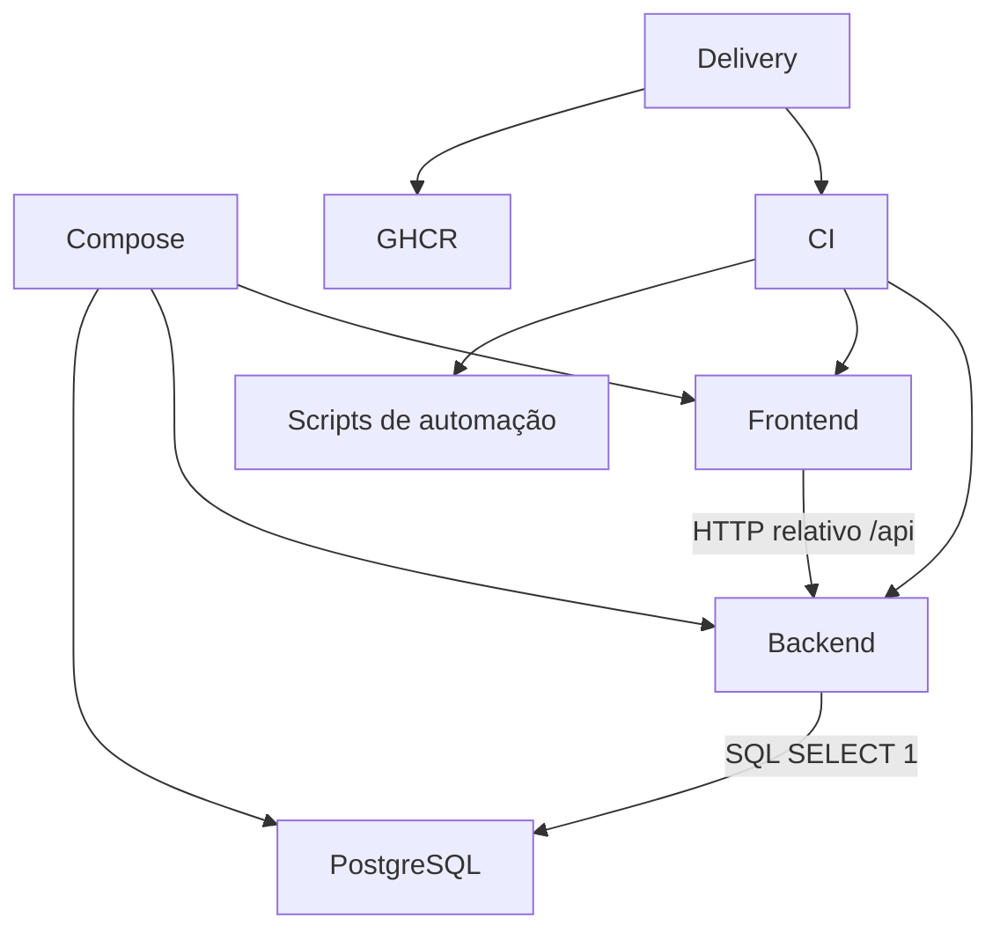
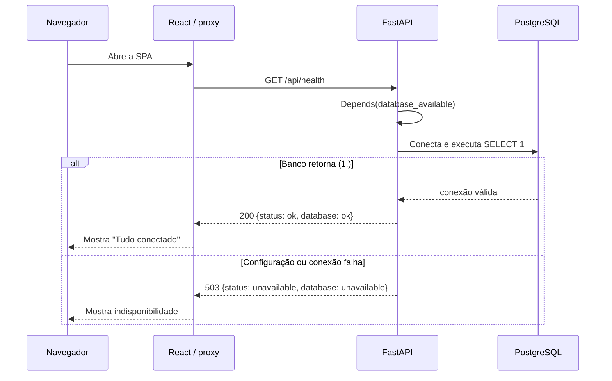

# Arquitetura

## Visão geral

Pense no sistema como um balcão de atendimento com três partes: a página no navegador pergunta à API se os serviços estão funcionando; a API faz uma pergunta simples ao PostgreSQL; e a página mostra se a resposta voltou. Essa base ainda não calcula preços nem guarda produtos ou usuários.

## Mapa e dependências

| Módulo | Entrada/responsabilidade | Depende de |
|---|---|---|
| `backend/app` | Expõe `/api/health` e testa conectividade | PostgreSQL e configuração de ambiente |
| `frontend/src` | Apresenta os estados da verificação | Endpoint relativo `/api/health` |
| `infraestrutura` | Executa, conecta e empacota os módulos | Docker Compose, imagens base e GitHub Actions |
| `.github/scripts` | Aplica política de PR e sincroniza Project quando configurado | API GitHub; token Project apenas na sincronização |

O frontend não acessa o PostgreSQL. O backend não depende do frontend. O Compose injeta os dados de conexão no backend e liga os serviços pela rede interna usando o host `db` (`docker-compose.yml#L18-L25`).

## Ciclo de uma requisição

No modo local, Vite encaminha `/api` para `http://localhost:8000` (`frontend/vite.config.ts#L6-L10`). No Compose, Nginx encaminha `/api/` para `http://backend:8000` (`frontend/nginx.conf#L7-L14`). Erro de rede entre navegador e API vira um estado separado no frontend (`frontend/src/health.ts#L16-L40`).

## Backend, middleware e processamento assíncrono

`GET /api/health` é a única rota declarada pela aplicação, em `backend/app/main.py#L9-L20`. Ela é uma função síncrona, injeta a dependência `database_available`, e devolve um modelo Pydantic `HealthResponse`. A chamada ao psycopg também é síncrona (`backend/app/health.py#L13-L31`). A configuração padrão de `FastAPI()` também cria `GET/HEAD /openapi.json`, `/docs`, `/docs/oauth2-redirect` e `/redoc` para esquema e interfaces de documentação; veja a [tabela de rotas](apps/backend.md#rotas).

FastAPI instala seu conjunto padrão de middlewares, mas o projeto não registra middleware próprio, CORS, autenticação ou handler global de exceção. A busca no código atual não encontrou signals, filas, agendadores ou tarefas assíncronas. A consulta de saúde ocorre durante a própria requisição.

## Integrações externas

| Integração | Uso atual | Limite |
|---|---|---|
| PostgreSQL 17 | `SELECT 1` para verificar conectividade | Sem tabelas, migrações ou ORM |
| GitHub Actions | CI, política de PR, sincronização opcional de Project e entrega | Project exige `PROJECT_TOKEN`; veja [github-workflow.md](github-workflow.md) |
| GitHub Container Registry (GHCR) | Publicação de backend e frontend após workflow em `main` | Não implanta os containers em um ambiente externo |
| Docker Hub | Imagens base de PostgreSQL, Python, Node e Nginx | Requer acesso ao registry para build/pull |

## Configuração por ambiente

| Variável | Consumidor | Padrão/uso | Observação |
|---|---|---|---|
| `POSTGRES_DB` | Compose/PostgreSQL | `bestprice` | Nome inicial do banco |
| `POSTGRES_USER` | Compose/PostgreSQL | `bestprice` | Usuário inicial |
| `POSTGRES_PASSWORD` | Compose/PostgreSQL e backend | Obrigatória no Compose | `.env.example` traz apenas valor fictício; substitua localmente |
| `DB_PORT` | Compose, script de worktree e backend | `5433` no checkout principal; `5432` no backend sem variável | Porta publicada em loopback; no backend Compose a porta é `5432` |
| `BACKEND_PORT` | Compose e script de worktree | `8000` | Porta publicada em loopback |
| `FRONTEND_PORT` | Compose e script de worktree | `5173` | Porta publicada em loopback; Nginx escuta internamente em `80` |
| `DATABASE_URL` | `backend/app/config.py` | Sem valor padrão | Tem precedência sobre as variáveis `DB_*`; use URL PostgreSQL |
| `DB_HOST` | Backend | Sem valor padrão; Compose usa `db` | Necessária junto às demais `DB_*` quando `DATABASE_URL` não existe |
| `DB_NAME` | Backend | Sem valor padrão; Compose usa `POSTGRES_DB` | Mapeia para `dbname` do psycopg |
| `DB_USER` | Backend | Sem valor padrão; Compose usa `POSTGRES_USER` | Mapeia para usuário do psycopg |
| `DB_PASSWORD` | Backend | Sem valor padrão; Compose usa `POSTGRES_PASSWORD` | Evite expor em logs |
| `TEST_DATABASE_URL` | Teste de integração do backend | Ausente significa skip | Aponte para banco isolado; nunca use dados importantes |
| `PROJECT_TOKEN` | Workflow Project | Opcional, ausente desativa sincronização | Secret do GitHub com permissão de Project |
| `PROJECT_OWNER` | Workflow Project | Configuração opcional | Variável do GitHub Actions |
| `PROJECT_NUMBER` | Workflow Project | Configuração opcional | Variável do GitHub Actions |

O arquivo `.env.example` documenta somente a configuração local do Compose. Os workflows também definem valores de teste, como `TEST_DATABASE_URL`, dentro de CI.

## Topologia e ciclo de vida

`docker-compose.yml#L1-L39` define `db`, `backend` e `frontend`. O banco possui healthcheck `pg_isready`; o backend espera esse healthcheck passar. O frontend depende do backend para inicialização, mas não há healthcheck que prove disponibilidade HTTP da API antes de iniciar Nginx.

O volume nomeado `db-data` persiste dados entre `docker compose down` e nova subida. A aplicação atual não cria esquema nem migra dados. A API e a SPA são publicadas em `127.0.0.1` por padrão.

Em `main`, `.github/workflows/release.yml` valida o commit, constrói imagens Linux para backend e frontend, envia SBOM/proveniência e cria release com digests. O repositório documenta explicitamente que implantação externa, destino, credenciais, HTTPS, migração e rollback operacional ainda não estão configurados (`docs/github-workflow.md`).

## Pegadinhas e dívidas observadas

- O health check confirma apenas que uma conexão curta e `SELECT 1` funcionam naquele instante; não valida schema nem operações de negócio.
- A rota declara um `response_model` comum aos dois status. O JSON é o mesmo formato em 200 e 503; clientes devem usar status HTTP e validar os dois campos.
- Configuração ausente é convertida em indisponibilidade 503, não em erro de configuração separado.
- `DATABASE_URL` prevalece mesmo se variáveis `DB_*` estiverem presentes. Uma URL malformada não cai para os campos individuais.
- O driver é síncrono em endpoint síncrono. Isso evita bloquear um endpoint `async`, mas consultas futuras longas precisam de estratégia explícita.
- Não existe política de retry: cada consulta abre uma conexão nova e pode esperar até 3 segundos para conexão e até 3 segundos para statement.
- O script de worktree deriva portas diferentes, mas colisões de porta ainda são possíveis; suas mensagens de erro mencionam override de portas.
- A documentação do GitHub descreve Project e publicação de imagens; ela não deve ser interpretada como evidência de implantação externa ativa.
