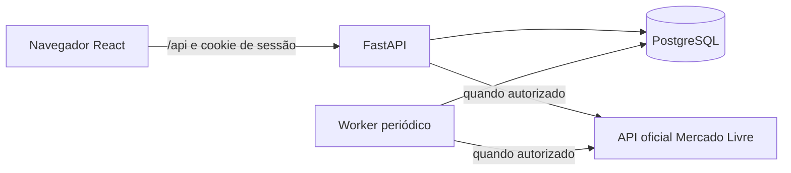

# Arquitetura

## Estado desta branch

A aplicação combina SPA React, API FastAPI, PostgreSQL 17 e um processo worker. O fluxo de negócio implementado nesta branch usa publicações do Mercado Livre Brasil (MLB). A [visão do produto](product-context.md) adota o Mercado Livre Brasil como marketplace exclusivo desta fase, substituindo a premissa Amazon anterior; o acesso real a anúncios de terceiros do Mercado Livre ainda depende de validação externa.

A SPA consome rotas de sessão, dashboard, monitoramentos, histórico, alertas e notificações por `frontend/src/api.ts`. FastAPI isola autenticação em `app/auth`, consulta externa em `app/marketplace`, regras e persistência em `app/products`, e seleção periódica em `app/monitoring`. O produto é compartilhado pelo identificador da publicação; cada usuário tem seu vínculo e alerta. A migration Alembic prepara o esquema antes de iniciar a API no Compose.

Uma URL MLB e os vínculos já persistidos são resolvidos antes de construir o cliente externo. URL inválida ou de formato não suportado, duplicação, retomada, `Retry-After` vigente, backoff, intervalo mínimo e `not_found` recente são decididos localmente, tanto no cadastro quanto na atualização; só uma consulta necessária à publicação exige a integração. Cada consulta é serializada por publicação com trava advisory PostgreSQL em conexão própria, e a transação de leitura é confirmada antes da chamada HTTP externa. O cliente real requer `MERCADOLIVRE_THIRD_PARTY_VALIDATED=true`, variáveis OAuth configuradas e a conta operadora provisionada no banco. A configuração padrão mantém consultas externas inativas. Access e refresh tokens são cifrados com a chave do ambiente; API e worker usam o mesmo registro e serializam a renovação por trava PostgreSQL. Resposta ambígua de refresh bloqueia nova tentativa até reprovisionamento, e 429 adia nova tentativa conforme `Retry-After`. Nenhum fluxo oficial com credenciais reais ou acesso a anúncios de terceiros foi comprovado. Falhas de consulta, inclusive na obtenção do token OAuth, registram a tentativa sem apagar o preço anterior. O worker verifica a configuração ao iniciar cada ciclo e consulta apenas produtos com vínculo ativo e horário vencido; pula a publicação já em consulta e isola exceções inesperadas de cada publicação, registrando a falha sem interromper o ciclo nem sobrescrever um sucesso mais recente. O lote e a concorrência têm limites configuráveis; publicações diferentes em paralelo usam sessões de banco independentes. Sucesso agenda nova consulta pela cadência configurada; erro temporário preserva a última observação e agenda backoff exponencial com jitter de 20%, respeitando `Retry-After`. Após `not_found`, uma falha transitória mantém esse estado e o intervalo mínimo de 24 horas; uma nova confirmação de `not_found` zera os contadores de falha. A janela configurada de frescor determina reuso do preço, o campo `stale` e a elegibilidade do preço para alertas; preço vencido deixa a condição `unknown` e não gera notificação.

| Configuração | Uso |
|---|---|
| `POSTGRES_DB`, `POSTGRES_USER`, `POSTGRES_PASSWORD` | Banco Compose |
| `DATABASE_URL` ou `DB_HOST`, `DB_NAME`, `DB_USER`, `DB_PASSWORD`, `DB_PORT` | Conexão API, worker e Alembic |
| `BACKEND_PORT`, `FRONTEND_PORT`, `DB_PORT` | Portas locais do Compose |
| `MERCADOLIVRE_THIRD_PARTY_VALIDATED` | Liberação explícita após validar acesso a terceiros; padrão `false` |
| `MERCADOLIVRE_CLIENT_ID`, `MERCADOLIVRE_CLIENT_SECRET`, `MERCADOLIVRE_OAUTH_KEY` | Cliente OAuth e chave Fernet da conta operadora; segredos somente no ambiente |
| `APP_ENV` | Cookie Secure quando igual a `production` |
| `MONITOR_CHECK_INTERVAL_SECONDS`, `MONITOR_FRESHNESS_SECONDS` | Cadência após sucesso e janela de frescor, ambas com padrão de 3600 segundos e faixa de 60 a 86400 |
| `MONITOR_BATCH_LIMIT`, `MONITOR_MAX_CONCURRENCY` | Publicações por ciclo (padrão 20, faixa 1 a 100) e tentativas paralelas (padrão 1, faixa 1 a 16) |
| `MONITOR_POLL_INTERVAL_SECONDS` | Pausa entre ciclos (padrão 60 segundos, faixa 1 a 3600) |
| `TEST_DATABASE_URL` | Banco isolado dos testes de integração |

O Compose inicia DB, executa Alembic no backend, aguarda seu health check e inicia worker e frontend. GitHub Actions valida o código e publica imagens após o fluxo de release; não há implantação externa configurada. Consulte os guias de [backend](apps/backend.md), [frontend](apps/frontend.md), [banco](database.md) e [infraestrutura](apps/infraestrutura.md).
