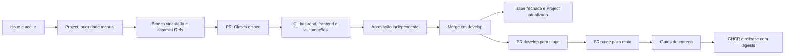

# Fluxo integrado do GitHub

## Da tarefa à entrega



`develop` é a branch padrão e a base das tarefas. `stage` valida candidatas e
`main` publica releases. A spec descreve o comportamento; a Issue identifica a
tarefa e o Project organiza prioridade, responsáveis e progresso. Nenhum desses
registros substitui as evidências de verificação.

## Iniciar uma tarefa

1. Abra uma Issue pelo formulário **Tarefa**, com resultado esperado e aceite.
2. No Project, defina prioridade P0–P3 e ordem. Atribua um responsável quando o
   trabalho começar; isso move a Issue para **In progress** após sincronização.
3. Crie a spec quando aplicável e uma branch ligada à Issue:

   ```powershell
   gh issue develop 123 --base develop --name feature/0007-issue-123-descricao
   git fetch origin
   git worktree add .worktrees/feature-0007-issue-123-descricao --track -b feature/0007-issue-123-descricao origin/feature/0007-issue-123-descricao
   ```

4. Commits seguem Conventional Commits e incluem `Refs #123` no corpo:

   ```powershell
   git commit -m 'feat(backend): adiciona recurso' -m 'Refs #123'
   ```

5. Abra uma PR para develop, com **uma linha real** `Closes #123`, o caminho da
   spec e evidências. Branches aceitas: `feature|fix|chore|docs/`, número de spec
   opcional, `issue-123-descricao`. A referência deve ser uma Issue local aberta.
   Commits de merge usados para atualizar a branch são dispensados do rodapé.
6. Aguarde CI e solicite revisão a outra pessoa com permissão de escrita. Resolva
   conversas e atualize a branch se develop avançar. Faça merge pelo GitHub.

Promoções aceitam develop → stage e stage → main do mesmo repositório.
Sincronizações reversas aceitam main → stage e stage → develop. Esses quatro
fluxos dispensam Issue nova e rodapés dos commits históricos. Use **merge commit** nas
promoções para preservar a ancestralidade entre branches duradouras. Uma correção
de release volta ao fluxo de tarefa em develop. Após uma promoção, abra as PRs
reversas necessárias para a origem conter o commit atual da base antes da próxima
promoção. Elas exigem os mesmos checks e aprovação; não faça push direto. Isso
evita que a exigência de branch atualizada impeça a próxima release. Não há merge automático.

Se uma nova feature entrar em develop antes de uma promoção ou sincronização terminar,
use este procedimento de recuperação, sempre em uma branch temporária e com merge commit:

```powershell
gh issue develop 123 --base develop --name chore/issue-123-sync-stage
git fetch origin
git worktree add .worktrees/chore-issue-123-sync-stage --track -b chore/issue-123-sync-stage origin/chore/issue-123-sync-stage
git -C .worktrees/chore-issue-123-sync-stage merge --no-ff origin/stage
git -C .worktrees/chore-issue-123-sync-stage push origin HEAD
gh pr create --base develop --head chore/issue-123-sync-stage --title 'chore(ci): sincroniza stage com develop' --body 'Refs #123'
```

Depois do merge dessa PR, repita develop → stage. Para divergência envolvendo main,
incorpore também `origin/main` na branch temporária antes de abrir a PR para develop.
Esse procedimento promove o develop atual, incluindo features novas; se a release
precisar ser congelada, crie uma decisão explícita de produto antes de prosseguir.

## O que roda automaticamente

| Workflow | Evento | Resultado e permissões |
|---|---|---|
| CI | PR aberta, atualizada, reaberta, editada ou pronta para revisão; push em develop/stage/main | Quality + política de PR; token de leitura; sem secrets |
| Quality | Chamado por CI e Delivery | Java 25/Maven verify; Node 22/npm ci/build/test; testes Node e actionlint |
| Project sync | Issue aberta/reaberta/fechada/atribuída; ciclo de draft/revisão/fechamento de PR | Adiciona item e atualiza Status, com PROJECT_TOKEN |
| Delivery | Push em main; execução manual na main | Repete Quality, publica duas imagens GHCR e cria release após ambas |

O check obrigatório chama-se **CI**. Ele falha se qualquer gate falhar ou for
cancelado. Não usamos filtros de caminhos que deixariam checks obrigatórios
pendentes. A política de PR é repetida quando o corpo é editado. A Issue deve
permanecer aberta até o merge; mudança externa da Issue após CI pode exigir rerun.

O fechamento é nativo do GitHub: `Closes #123` só fecha ao integrar na branch
padrão. Alterar a padrão para main adia esse fechamento e a ativação dos eventos
de Issues até que os workflows cheguem à main. Fechar a Issue não significa que
a feature já foi implantada: significa que foi integrada na linha diária.

## Proteções e ativação inicial

Administrador do repositório:

```powershell
gh repo edit SamiaLuvanice/bestprice --default-branch develop
.\scripts\configure-github.ps1          # inspecionar JSON
.\scripts\configure-github.ps1 -Apply   # criar/atualizar ruleset integration-branches
```

O ruleset exige nas três branches PR, uma aprovação independente, aprovação após
o último push, descarte de aprovações antigas, conversas resolvidas e **CI** atual
em relação à base. Proíbe remoção e force push; não configura bypass de administrador.
O script preserva outros rulesets. Um administrador precisa autorizar Actions e
as Actions fixadas nos YAMLs se houver uma allowlist da organização.

**Bootstrap:** o CI da PR pode rodar antes do merge dos workflows. Ative a proteção
após confirmar o primeiro check CI, ainda antes de integrar a PR inicial. Templates,
eventos de Issues e workflow_dispatch ficam disponíveis quando os arquivos entram
na branch padrão. Delivery automático só começa quando a implementação chega a
main pelo fluxo de promoção. Não copie workflows isolados diretamente para branches
protegidas nem use bypass para instalar o próprio fluxo.

Um repositório com uma única pessoa não consegue satisfazer uma aprovação própria.
É necessário convidar um colaborador com permissão de escrita. A confirmação em
chat não cria uma aprovação no GitHub; políticas mais flexíveis exigem uma decisão
explícita e alteração revisada da configuração.

## Configurar o Project (permissão adicional)

O token de sessão usado na implementação não possui `read:project`/`project`.
O `GITHUB_TOKEN` também não acessa Projects. Criação e automação ficam pendentes
até que o responsável conceda acesso; nenhum token de sessão é copiado para Actions.

1. Para configurar interativamente pela CLI: `gh auth refresh -s project` e complete
   a autorização no navegador. Crie um Project pelo GitHub ou
   `gh project create --owner SamiaLuvanice --title bestprice --format json`.
   Guarde seu número, associe o repositório pela interface ou `gh project link`.
2. No campo **Status**, configure exatamente: **Todo**, **In progress**, **In review**,
   **Done**, **Canceled**. Crie **Priority** com P0/P1/P2/P3 e uma visão Board por Status.
   Priorização e ordenação são manuais. Desative automações nativas que também
   alterem Status (especialmente fechamento/merge), evitando disputa com este workflow.
3. Para um Project de usuário, crie um PAT dedicado com expiração e escopo `project`
   e acesso de leitura ao repositório (`public_repo` para este repositório público;
   `repo` se for privado). O titular precisa poder escrever no Project. Nunca use
   esse token para executar código de PR ou como credencial de publicação.
4. Configure o secret usando o prompt seguro de `gh secret set PROJECT_TOKEN`;
   defina `gh variable set PROJECT_OWNER --body SamiaLuvanice` e
   `gh variable set PROJECT_NUMBER --body NUMERO`. Pode usar a interface Settings
   → Secrets and variables → Actions. Não coloque valores secretos na documentação.
5. Após os workflows estarem na padrão, reconcilie itens anteriores:

   ```powershell
   gh workflow run project.yml --ref develop -f kind=issue -f number=12
   # Para uma PR: -f kind=pr -f number=NUMERO
   ```

| Item | Estado no GitHub | Status no Project |
|---|---|---|
| Issue | Aberta sem responsável | Todo |
| Issue | Aberta com responsável | In progress |
| Issue | Fechada como concluída | Done |
| Issue | Fechada como não planejada | Canceled |
| PR | Draft aberto | In progress |
| PR | Aberta para revisão | In review |
| PR | Merge concluído | Done |
| PR | Fechada sem merge | Canceled |

Issues e PRs aparecem como itens separados. A Issue continua In progress durante
a revisão da PR e vai a Done com o fechamento nativo; a PR representa a etapa de
revisão. A API adiciona itens de forma idempotente, consulta o estado atual e
preserva prioridade/ordenação. Eventos são serializados por número. Workflow sem
token gera aviso e resumo **não sincronizado**; erro de token/campo com token
presente falha visivelmente. Corrija a configuração e execute novamente. Eventos
criados por outro workflow usando GITHUB_TOKEN podem não gerar novo workflow;
reconcilie explicitamente esses casos. Não há sincronização retroativa automática.

## Entrega e implantação

Cada push aprovado em main dispara Delivery. Quality valida o mesmo SHA; os jobs
publicam `ghcr.io/samialuvanice/bestprice-backend` e `bestprice-frontend` com tags
`sha-SHA_COMPLETO` e `build-SHA12`. Uma release `build-SHA12` só é criada quando as
duas imagens terminam e contém seus **digests**. SBOM e provenance são gerados
pelo BuildKit. São imagens Linux amd64; frontend servido por nginx.

Opcionalmente, execute na main para uma versão escolhida:

```powershell
gh workflow run release.yml --ref main -f version=v1.0.0
```

Versões existentes não são sobrescritas. O job `prepare` cria a tag no SHA testado,
o job final a consulta novamente antes de criar a release e o ruleset `delivery-tags`
impede apagar ou mover tags `v*`/`build-*`. Se a tag mudar entre a consulta final e
o POST da release, o GitHub pode ainda rejeitar a operação; a release deve então ser
considerada falha e a tag precisa ser investigada por um administrador.
Tags de imagem são conveniências mutáveis;
use `imagem@sha256:...` da release para entrega/rollback reproduzível. Se só uma
imagem foi publicada, não há release concluída: corrija a falha e rerode todos os
jobs para o mesmo commit/versão. Uma falha parcial pode deixar imagens sem release.
Após uma release completa, escolha uma nova versão para outra entrega. Não existe
tag `latest` nem rollback automático. Execuções pendentes podem ser agrupadas pelo
controle de concorrência; se for necessário entregar um commit intermediário,
prepare uma promoção/release explicitamente.

GHCR usa `GITHUB_TOKEN` com `packages: write`; criação da release usa `contents:
write` somente no job final. Pacotes novos podem ser privados mesmo em repositório
público: ajuste a visibilidade e o acesso do repositório nas configurações do pacote.
Se um pacote já existe, permita acesso de Actions deste repositório. Consumidores
de pacote privado precisam de credencial própria com `read:packages`.

**Implantação externa não configurada:** faltam destino, credenciais/OIDC, segredos
da conta/banco, HTTPS, migração e política de rollback. A entrega atual termina em
GHCR + release. Ao escolher o destino, crie uma spec com environment protegido,
aprovação e health check antes de adicionar o job de implantação. Não reutilize
credenciais de estudo em infraestrutura pública.

## Manutenção e referências

Actions estão fixadas em commits. Revise atualizações periodicamente; o actionlint
também tem versão fixa. Mantenha o nome do check CI estável ou atualize o ruleset
junto. Specs/verification e a aba Actions guardam evidências; relatórios Maven e
metadados de imagens ficam disponíveis por sete dias.

- [Vínculo e fechamento de Issues](https://docs.github.com/en/issues/tracking-your-work-with-issues/using-issues/linking-a-pull-request-to-an-issue).
- [Projects via Actions e permissões](https://docs.github.com/en/issues/planning-and-tracking-with-projects/automating-your-project/automating-projects-using-actions).
- [Eventos, branch padrão e pull_request_target](https://docs.github.com/en/actions/reference/workflows-and-actions/events-that-trigger-workflows).
- [Publicação de imagens](https://docs.github.com/en/actions/tutorials/publish-packages/publish-docker-images).
- [GHCR e acesso aos pacotes](https://docs.github.com/en/packages/working-with-a-github-packages-registry/working-with-the-container-registry).
